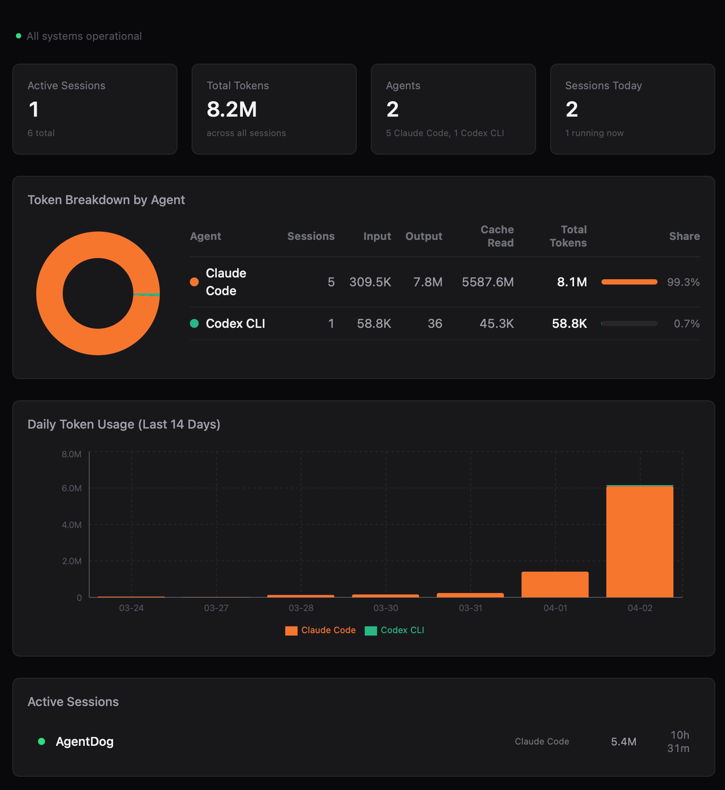
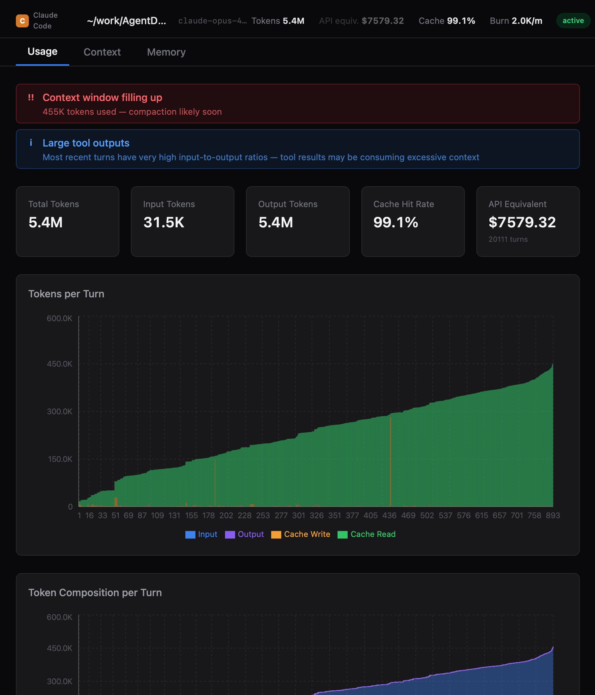

# AgentDog

**See what your AI agents are actually spending.**

A lightweight macOS app that monitors [Claude Code](https://docs.anthropic.com/en/docs/claude-code), [OpenAI Codex](https://openai.com/index/codex/), and [OpenClaw](https://github.com/openclaw/openclaw) sessions in real time. Token usage, costs, context window health, tool call patterns — all in one dashboard. No API keys. No agent modifications. Just install and go.



## Install

[Download the latest release](https://github.com/shenli/AgentDog/releases) (macOS Apple Silicon) — open the DMG and drag to Applications.

> On first launch, macOS may block the app. Go to **System Settings > Privacy & Security** and click **Open Anyway**.

## The Problem

You're running coding agents for hours, but you can't see what's happening:

- A session burns through your token quota and you only notice when it starts throttling
- The context window fills up silently — your agent breaks mid-task with no warning
- A config change breaks prompt caching and costs spike 5x
- A single `git log --stat` eats 30% of your context and nobody tells you
- You're running multiple agents across projects with no unified view of total spend

## What AgentDog Shows You



- **Token and cost breakdown** per turn — input, output, cache read/write
- **Context overflow warnings** before compaction happens
- **Cache efficiency tracking** with invalidation detection
- **Tool cost ranking** — which tools consume the most tokens
- **Anomaly detection** — flags turns that cost 3x+ the running average
- **Daily spending trends** across all agents and sessions
- **Provider status** — live Anthropic and OpenAI operational status

## How It Works

AgentDog reads the transcript files that agents already write to disk:

| Agent | Data source |
|-------|------------|
| Claude Code | `~/.claude/projects/*/sessions/*.jsonl` |
| OpenAI Codex | `~/.codex/state_5.sqlite` + `~/.codex/sessions/**/*.jsonl` |
| OpenClaw | `~/.openclaw/agents/*/sessions/*.jsonl` |

Read-only. Runs locally. Never writes to agent directories. Data stored in `~/.agentdog/data.sqlite`.

## Build from Source

Requires [Rust](https://rustup.rs/) and [Node.js](https://nodejs.org/) 18+.

```bash
git clone https://github.com/shenli/AgentDog.git
cd AgentDog
npm install
npm run dev
```

## Contributing

Contributions welcome. Please [open an issue](https://github.com/shenli/AgentDog/issues) before submitting large changes.

## License

[Apache 2.0](LICENSE)
